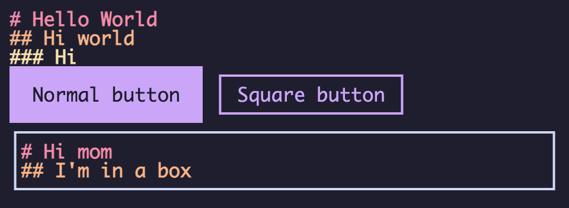

It is **highly recommended** that you use **CSS Imports** with **WebTUI**

It's _possible_ to use [ESM imports](#esm-imports) or [CDN imports](#cdn-imports)

You _will still have to write **some CSS**_, so you'd might as well use it, the way God intended

## Installation

Install the base WebTUI package with your preferred package manager

```bash
bun i @webtui/css
npm i @webtui/css
yarn add @webtui/css
pnpm install @webtui/css
```

## Setup

In your global CSS file, **before** importing the base styles, define the order of layers using the `@layer` at-rule [[MDN Reference]](https://developer.mozilla.org/en-US/docs/Web/CSS/@layer)

```css
@layer base, utils, components;

@import "@webtui/css/base.css";
```

- `base` consists of default styles and CSS variables (see [base config](/reference/base-config))
- `utils` consists of utility style rules
- `components` contains styles for all components

After importing the base styles, you can import color themes, utilities, and components

```diff
@layer base, utils, components;

@import "@webtui/css/base.css";

+/* Utils */
+@import "@webtui/css/utils/box.css";
+
+/* Components */
+@import "@webtui/css/components/button.css";
+@import "@webtui/css/components/input.css";
+@import "@webtui/css/components/typography.css";
+
+/* Theme */
+@import "@webtui/theme-catppuccin";
```

Add some HTML

```html
<h1>Hello World</h1>
<h2>Hi world</h2>
<h3>Hi</h3>

<button>Normal button</button>

<button box-="square">Square button</button>

<div box-="square">
  <h1>Hi mom</h1>
  <h2>I'm in a box</h2>
</div>
```

Now your website should look **awesome**



## ESM Imports

Although a huge [soyjack](https://knowyourmeme.com/editorials/guides/who-is-soyjack-the-meme-and-wojak-character-explained) move, you can import stylesheets via ESM if your bundler supports it

```tsx
import "@webtui/css/components/button.css";

type Props = {/* ... */};

export default function Button(props: Props) {
    return <button>{props.children}</button>;
}
```

## CDN Imports

You can import specific stylesheets via `<link>` tags via CDN if you like **thiccc** `<head>` tags

```html
<link rel="stylesheet" href="https://cdn.jsdelivr.net/npm/@webtui/css/dist/base.css" />
```

To import a specific version, add `@<version>` to the CDN URL after `/@webtui/css`

```html
<link rel="stylesheet" href="https://cdn.jsdelivr.net/npm/@webtui/css@0.0.0/dist/base.css" />
```

Although not recommended, you can just use the latest version of WebTUI by using the `@latest` tag for the version.

**Note:** You must define the order of layers **before** importing any styles from **WebTUI**

```html
<style>
  @layer base, utils, components;
</style>
<link rel="stylesheet" href="https://cdn.jsdelivr.net/npm/@webtui/css@0.0.0/dist/base.css" />
<link rel="stylesheet" href="https://cdn.jsdelivr.net/npm/@webtui/css@0.0.0/dist/components/button.css" />
<!-- ... -->
```

You can view and access all available stylesheets on the CDN via [JSDelivr](https://cdn.jsdelivr.net/npm/@webtui/css@0.0.0/dist/)

## Full Library Import

WebTUI was designed with a modular approach in mind so you can import only the parts you need

For testing, you can import the entire library by just importing the package's base path after defining the order of layers

```css
@layer base, utils, components;

@import "@webtui/css";
@import "@webtui/theme-catppuccin";
```

ESM Imports are almost identical to CSS imports

```js
import "@webtui/css";
import "@webtui/theme-catppuccin";
```

For the CDN, you will have to import `/dist/full.css` instead of the base path

```html
<link rel="stylesheet" href="https://cdn.jsdelivr.net/npm/@webtui/css/dist/full.css" />
<link rel="stylesheet" href="https://cdn.jsdelivr.net/npm/@webtui/theme-catppuccin/dist/full.css" />
```
