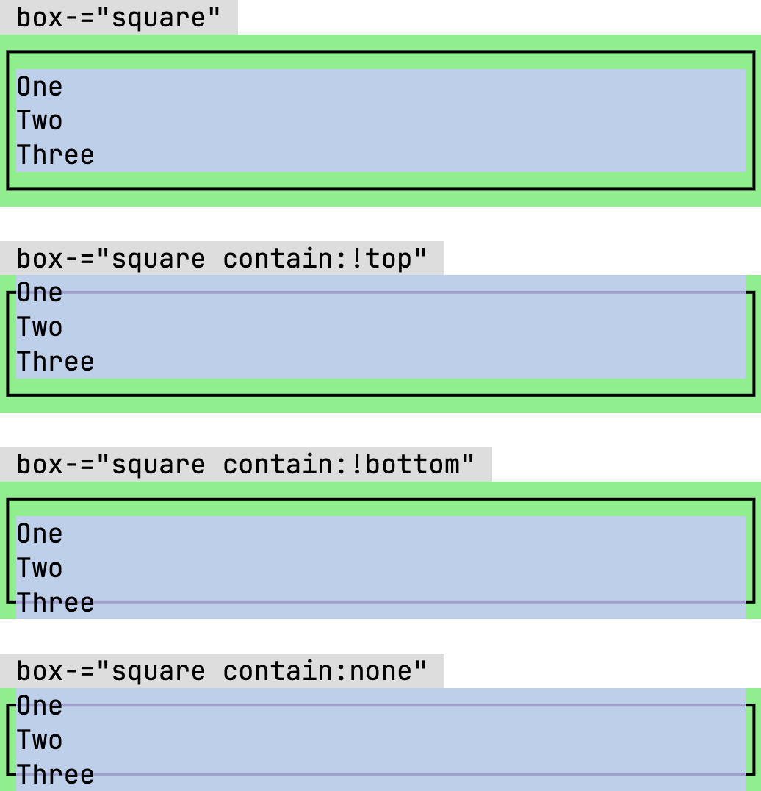
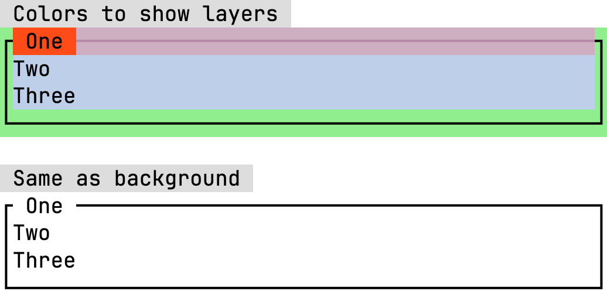

The **Box** utility utilizes CSS `::before` and `::after` pseudo-elements to mimic a boxes drawn with ASCII [Box-drawing characters](https://en.wikipedia.org/wiki/Box-drawing_characters)

Below is an example of what you can do with the box utility:

<div flex-="row">
    <div box-="square contain:none" flex-="col">
        <div flex-="row justify:between">
            <span is-="badge">top-left</span>
            <span is-="badge">top-right</span>
        </div>
        <div space-="p:1">Lorem ipsum dolor sit amet idk i dont speak French</div>
        <div flex-="row justify:end gap:1" space-="px:1">
            <button variant-="secondary" box-="round">Cancel</button>
            <button box-="round">Ok</button>
        </div>
        <div flex-="row justify:between">
            <span is-="badge">bottom-left</span>
            <span is-="badge">bottom-right</span>
        </div>
    </div>
</div>

## Usage

Import the utility stylesheet

```css
@import "@webtui/css/utils/box.css";
```

Add the `box-` attribute to any HTML element that supports pseudo-elements

```html
<div box-="square">
    <h1>Hi Mom</h1>
</div>
```

<div flex-="row">
    <div box-="square">
        <h1>Hi Mom</h1>
    </div>
</div>

**Important**: The `box-` utility is **suffixed** with a **dash** (`-`). Using `box="..."` **will not work**

## Border Types

The box utility supports three different border types:

```html
<div box-="square"></div>
<div box-="round"></div>
<div box-="double"></div>
```

<div flex-="row wrap gap:1">
    <div box-="square"><code>box-="square"</code></div>
    <div box-="round"><code>box-="round"</code></div>
    <div box-="double"><code>box-="double"</code></div>
</div>

## Containment

You can choose whether to contain the top and/or bottom lines of the box by adding a containment keyword to the `box-` attribute

- `box-="<type> contain:!top"` will **not** contain the top line
- `box-="<type> contain:!bottom"` will **not** contain the bottom line
- `box-="<type> contain:none"` will **not** contain the top or bottom lines

Take a moment and observe the screenshot below

- Highlighted in **<span style="color: var(--blue)">blue</span>** is the **content** of the box
- Highlighted in **<span style="color: var(--green)">green</span>** is the **padding** of the box



The box border lines are constructed with the CSS `::before` and `::after` pseudo-elements and are layered **behind** the content, as you can see in the screenshot above

### Creating a Caption

The following screenshot breaks down the layers of making a caption appear to be in the top or bottom row of a box

- The box has `contain:!top` set to specifically **not** contain the top line
- The top line serves as the caption
- The top line is a `<div>` that contains a `<span>` element with the text "One"

In the colored example, the `<div>` on the first line is colored
In the uncolored example, the `<span>` containing the text "One" is colored the same as the background



## Custom Properties

Elements with the `box-` attribute can be customized several custom CSS properties [[MDN Reference]](https://developer.mozilla.org/en-US/docs/Web/CSS/@property)

### `--box-border-color`

The border color of the box

- Syntax: `<color>`
- Default Value: `var(--foreground0)`

```html
<style>
#my-box {
  --box-border-color: red;
}
</style>

<div box-="square" id="my-box"></div>
```

### `--box-rounded-radius`

The border radius of the `round` boxes

- Syntax: `<length>`
- Default Value: `4px`

```html
<style>
#my-box {
  --box-rounded-radius: 10px;
}
</style>

<div box-="round" id="my-box"></div>
```

### `--box-border-width`

The border width for `square` and `round` boxes

- Syntax: `<length>`
- Default Value: `2px`

```html
<style>
#my-box {
  --box-border-width: 10px;
}
</style>

<div box-="square" id="my-box"></div>
```

### `--box-double-border-width`

The width of boxes with `double` borders

- Syntax: `<length>`
- Default Value: `1px`

```html
<style>
#my-box {
  --box-double-border-width: 10px;
}
</style>
