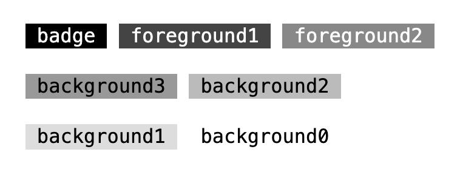

The **Badge** stylesheet provides styles for badges



## Installation

```css
@import "@webtui/css/components/badge.css";
```

## Usage

Simply add the `is-="badge"` attribute to any element

```html
<span is-="badge">badge</span>
```

### `variant-`

Use the `variant-` attribute to change the color of the badge

```html
<span is-="badge" variant-="foreground1">foreground1</span>
<span is-="badge" variant-="background2">background2</span>
```

#### Values

- `variant-="foreground0"`
- `variant-="foreground1"`
- `variant-="foreground2"`
- `variant-="background0"`
- `variant-="background1"`
- `variant-="background2"`
- `variant-="background3"`

Defaults to `foreground0`

### Styling

For arbitrary styling, use the custom `--badge-color` and `--badge-text` properties to style the badge

```css
#my-custom-badge {
  --badge-color: #ffffff;
  --badge-text: #000000;
}
```

## Scope

- All elements with the `is-~="badge"` selector

```css
[is-~="badge"] { /* ... */ }
```
