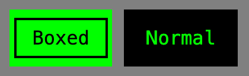

## Import

```css
@import "@webtui/css/components/button.css";
```

The [Box Utility](/intro/ascii-boxes) can be used to add box borders to buttons

```css
@import "@webtui/css/utils/box.css";
```

## Usage

Create a `<button>` element, or add `is-="button"` to any HTML element

```html
<button>Normal button</button>
<div is-="button">Div Button</div>
```

### `box-`

Use the `box-` attribute to add a box border a button (requires the `box` utility)

```html
<button box-="round">Round</button>
<button box-="square">Square</button>
<button box-="double">Double</button>
```


### `variant-`

Use the `variant-` attribute to change the color of a button

Available variants match the [base theme colors](/start/theming#colors)

```html
<button variant-="background0"></button>
<button variant-="background1"></button>
<button variant-="background2"></button>
<button variant-="background3"></button>
<button variant-="foreground0"></button>
<button variant-="foreground1"></button>
<button variant-="foreground2"></button>
```

### `disabled`

Use the `disabled` attribute to mark a button as disabled

```html
<button disabled>Disabled</button>
```

### Styling

Buttons are styled using the custom `--button-primary` and `--button-secondary` CSS properties

```css
button {
    --button-primary: black;
    --button-secondary: green;
}
```

Buttons automatically switch between `--button-primary` and `--button-secondary` based on whether `box-` is applied or not



### Extending

To extend the Button stylesheet, define a CSS rule on the `components` layer

```css
@layer components {
    button, [is-~="button"] {
        &[variant-="red"] {
            --button-primary: red;
            --button-secondary: white;
        }

        /* ... */
    }
}
```

## Scope

```css
button, [is-~="button"] { /* ... */ }
```
