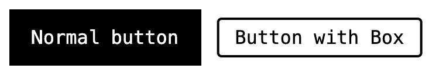

The **Button** stylesheet provides styles for **buttons**

## Installation

It is **highly recommended** that you use the [Box Utility](/utils/box) along with the Button stylesheet

```css
@import "@webtui/css/utils/box.css";
@import "@webtui/css/components/button.css";
```

## Usage

```html
<button>Normal button</button>
<button box-="round">Button with Box</button>
```



### `size-`

You can control the size of your button by using the `size-` attribute

```html
<button>Default</button>
<button size-="small">Small</button>
```


- `size-="small"` - A small button

### `box-`

To add a box border to your button, simply add the `box-` attribute and specify the box type you want

```html
<button box-="round">Round</button>
<button box-="square">Square</button>
<button box-="double">Double</button>
```


### Styling

Buttons are styled using the custom `--button-primary` and `--button-secondary` CSS properties

It's possible to set the button color using `background` and `color`

If you are using the `box-` utility, things get trickier due to the custom `--box-border-color` property

```css
button {
    --button-primary: black;
    --button-secondary: green;
}
```


Buttons will automatically switch between the primary and secondary colors based on whether the `box-` attribute is applied or not

## Scope

```css
button, [is-~="button"] { /* ... */ }
```
