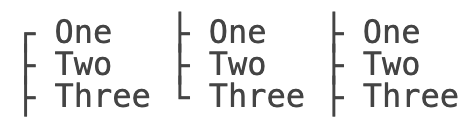

The **Typography** stylesheet provides styles for headings and inline elements

## Installation

```css
@import "@webtui/css/components/typography.css";
```

## Usage

### `<h1>`-`<h6>`

```html
<h1>Heading 1</h1>
<h2>Heading 2</h2>
<h3>Heading 3</h3>
<h4>Heading 4</h4>
<h5>Heading 5</h5>
<h6>Heading 6</h6>
```

### `<p>`

```html
<p>Lorem <strong>Ipsum</strong> <em>Dolor</em> <code>Sit</code> <a href="https://example.com">Amet</a></p>
```

### `<blockquote>`

```html
<blockquote>Lorem Ipsum Dolor Sit Amet</blockquote>
```

### `<ol>`

```html
<ol>
    <li>One</li>
    <li>Two</li>
    <li>Three</li>
</ol>
```

### `<ul>`

```html
<ul>
    <li>One</li>
    <li>Two</li>
    <li>Three</li>
</ul>
```

#### List Markers

You can customize list markers by using the `marker-` attribute on the `<ul>` element

```html
<ul><!--...--></ul>
<ul marker-="bullet"><!--...--></ul>
<ul marker-="tree"><!--...--></ul>
```


You can leave the top and/or bottom markers of the `tree` variant open by adding the `open` keyword to the start and/or end of `marker-`

```html
<ul marker-="tree open"><!--...--></ul>
<ul marker-="open tree"><!--...--></ul>
<ul marker-="open tree open"><!--...--></ul>
```



### `[is-="typography-block"]`

```html
<div is-="typography-block">
    Typography block
</div>
```

## Scope

- All HTML heading elements
- paragraphs, blockquotes, lists, list items, elements with `is-="typography-block"` and their respective inline elements

```css
h1, h2, h3, h4, h5 {/* ... */}

ul {/* ... */}
ol {/* ... */}

p,
blockquote,
li,
[is-~="typography-block"] {
    /* ... */

    strong {/* ... */}
    a {/* ... */}
    code {/* ... */}
}
```
