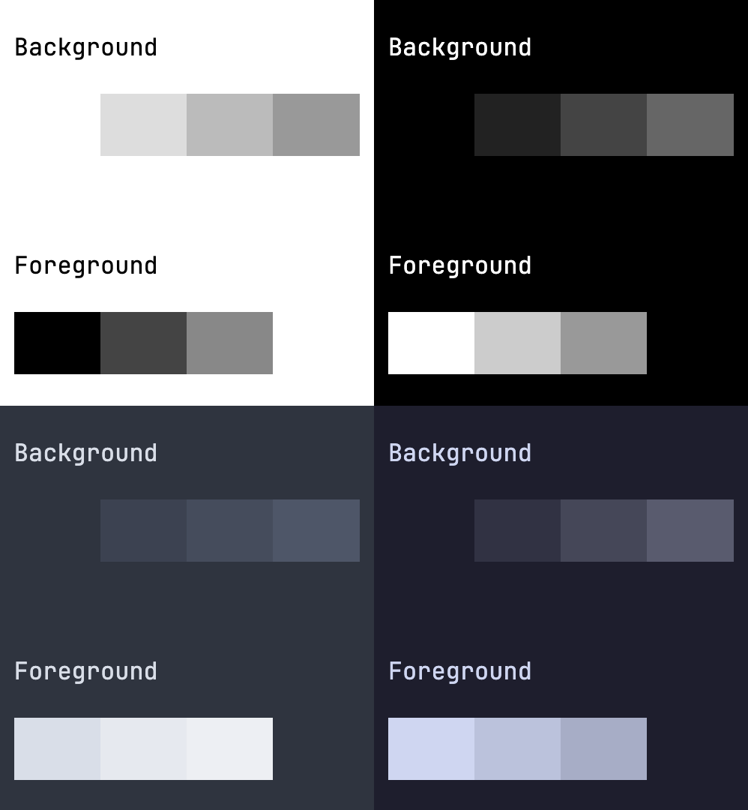

Theming can be done by editing the CSS variables in the base stylesheet, or if you install a [theme plugin](#theme-plugins)

## CSS Variables

`@webtui/css` ships with a set of CSS variables that control [font styles](#font-styles) and [background/foreground colors](#colors)

You can customize these variables by customizing the `:root` under `@layer base` in your global CSS file

```css
@layer base {
    :root {
        --font-size: 18px;
        --font-family: "JetBrainsMono", monospace;
    }
}
```

### Font Styles

```css
@layer base {
    :root {
        --font-size: 16px;
        --line-height: 1.3;
        /* Font weight for bold text */
        --font-weight-bold: 700;
        /* Font weight for regular text */
        --font-weight-normal: 400;
        --font-family: monospace;
    }
}
```

### Colors

The base theme consists of **four** background levels and **three** foreground levels

Additional color accents/variants can be added to components individually with CSS or by importing a [theme plugin](#theme-plugins)

```css
@layer base {
    :root {
        /* Default background color */
        --background0: #fff;
        /* Background levels 1-3 */
        --background1: #ddd;
        --background2: #bbb;
        --background3: #999;

        /* Default foreground color */
        --foreground0: #000;        
        /* Foreground levels 1-2 */
        --foreground1: #444;
        --foreground2: #888;
    }
}
```

Shown below is a screenshot showing the background and foreground colors of a basic light theme, dark theme, [Nord](https://nordtheme.com), and [Catppuccin](https://catppuccin.com/)



### Light & Dark

`@webtui/css` ships with a very basic black-and-white theme that automatically changes based on the user's color preference

You can customize dark/light mode colors with a `prefers-color-scheme` media query

```css
@layer base {
    @media(prefers-color-scheme: dark) {
        :root {
            --background0: #000;
            /* ... */
        }
    }
}
```

Alternatively, you can assign a class to the `html` element and use javascript to change it

```html
<html class="dark">
    <head>
        <style>
            @layer base {
                html.dark {
                    --background0: #000;
                    /* ... */
                }
            }
        </style>
    </head>
<!-- ... -->
</html>
```

## Theme Plugins

Theme plugins include additional color variants for individual components on top of changing the base colors


Check out the [Plugins](/plugins/intro) page for a list of available themes
