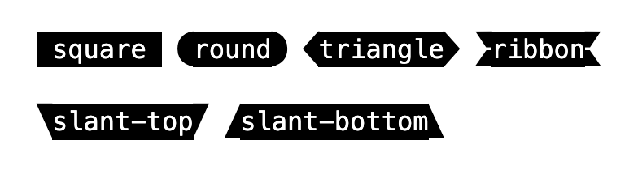
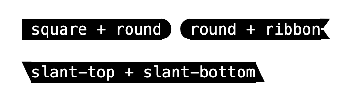

Provides additional variants that utilize a [Nerd Font](https://nerdfonts.com) to some base `@webtui/css` components

**Nerd Fonts** add additional glyphs from popular icon packs such as [Font Awesome](https://fontawesome.com), [Devicons](http://vorillaz.github.io/devicons/), [Octicons](https://github.com/github/octicons), and more

## Installation

Install the plugin with your preferred package manager

```bash
bun i @webtui/plugin-nf
npm i @webtui/plugin-nf
yarn add @webtui/plugin-nf
pnpm i @webtui/plugin-nf
```

Import the plugin at the end of your import chain

```css
@import "@webtui/css/base.css";
@import "@webtui/css/components/typography.css";
/* ... */

@import "@webtui/plugin-nf";
```

## Install a Nerd Font

### Static Font

Install a Nerd Font from https://nerdfonts.com and save the ttf files to your project's `public` or `static` directory

Use the `@font-face` CSS at-rule to define the font faces

```css
@font-face {
  font-family: "JetBrainsMonoNFM";
  src: url("/path/to/fonts/JetBrainsMonoNFM-Regular.ttf") format("truetype");
  font-stretch: normal;
  font-style: normal;
  font-weight: 400;
}

@font-face {
  font-family: "JetBrainsMonoNFM";
  src: url("/path/to/fonts/JetBrainsMonoNFM-Bold.ttf") format("truetype");
  font-stretch: normal;
  font-style: normal;
  font-weight: 700;
}

/* ... font styles ... */
```

### CDN

If you prefer to import a Nerd Fonts served via CDN, choose a Nerd Font from [this repository](https://github.com/mshaugh/nerdfont-webfonts) 

Add the desired font to the `<head>` of your HTML document

```html
<link
    href="https://cdn.jsdelivr.net/gh/mshaugh/nerdfont-webfonts@latest/build/jetbrainsmono-nfm.css"
    rel="stylesheet"
/>
```

## Components

- [Details](#details)
- [Badge](#badge)

---

### `<details>`

Modifies the marker of the `<summary>` element to be a chevron instead of the default `▶︎` and `▼` symbols

```html
<details>
    <summary>Open</summary>
    <p>Content</p>
</details>
```

### `Badge`

Adds additional end cap styles to badges



#### `cap-`

Use the `cap-` attribute to customize the start and end caps of badges

```html
<span is-="badge">square</span>
<span is-="badge" cap-="round">round</span>
<span is-="badge" cap-="triangle">triangle</span>
```

Passing two values separated by a space styles the start and end caps

```html
<span is-="badge" cap-="square round">square + round</span>
```



```html
<span is-="square"></span>
<span is-="round"></span>
<span is-="triangle"></span>
<span is-="ribbon"></span>
<span is-="slant-top"></span>
<span is-="slant-bottom"></span>
```
