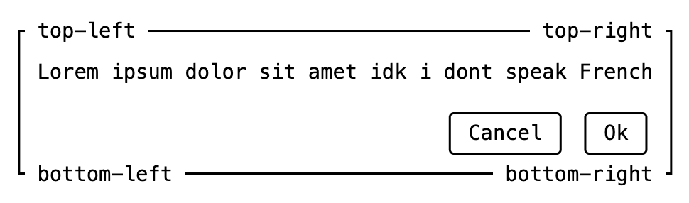

The `box-` utility utilizes CSS `::before` and `::after` pseudo-elements to mimic a boxes drawn with ASCII [Box-drawing characters](https://en.wikipedia.org/wiki/Box-drawing_characters)

Below is an example of what the box utility is capable of:



## Usage

Import the utility stylesheet

```css
@import "@webtui/css/utils/box.css";
```

Add the `box-` attribute to any HTML element that supports pseudo-elements

```html
<div box-="square">
  <h1>Hi Mom</h1>
</div>
```


**Important**: The `box-` utility is **suffixed** with a **dash** (`-`). Using `box="..."` **will not work**

## Border Types

The box utility supports three different border types:

```html
<div box-="square">Square</div>
<div box-="round">Round</div>
<div box-="double">Double</div>
```


## Containment

The top and/or bottom lines of the box can be contained by adding the `contain:*` modifier to the `box-` attribute

- `box-="<type> contain:!top"` will **not** contain the **top** line
- `box-="<type> contain:!bottom"` will **not** contain the **bottom** line
- `box-="<type> contain:none"` will **not** contain the _**top** or **bottom**_ lines

Take a moment and observe the screenshot below

- Highlighted in **<span style="color: var(--blue)">blue</span>** is the **content** of the box
- Highlighted in **<span style="color: var(--green)">green</span>** is the **padding** of the box
- The box border lines are constructed with the CSS `::before` and `::after` pseudo-elements
- The box border lines appear **behind** the content within the `<div box-="*">` element


## Custom Properties

Elements with the `box-` attribute can be customized via **Custom CSS properties** [[MDN Reference]](https://developer.mozilla.org/en-US/docs/Web/CSS/@property)

### `--box-border-color`

The border color of the box

- Syntax: `<color>`
- Default Value: `var(--foreground0)`

```html
<style>
  #my-box {
    --box-border-color: red;
  }
</style>

<div box-="square" id="my-box"></div>
```

### `--box-rounded-radius`

The border radius of the `round` boxes

- Syntax: `<length>`
- Default Value: `4px`

```html
<style>
  #my-box {
    --box-rounded-radius: 10px;
  }
</style>

<div box-="round" id="my-box"></div>
```

### `--box-border-width`

The border width for `square` and `round` boxes

- Syntax: `<length>`
- Default Value: `2px`

```html
<style>
  #my-box {
    --box-border-width: 10px;
  }
</style>

<div box-="square" id="my-box"></div>
```

### `--box-double-border-width`

The width of boxes with `double` borders

- Syntax: `<length>`
- Default Value: `1px`

```html
<style>
  #my-box {
    --box-double-border-width: 10px;
  }
</style>
```
